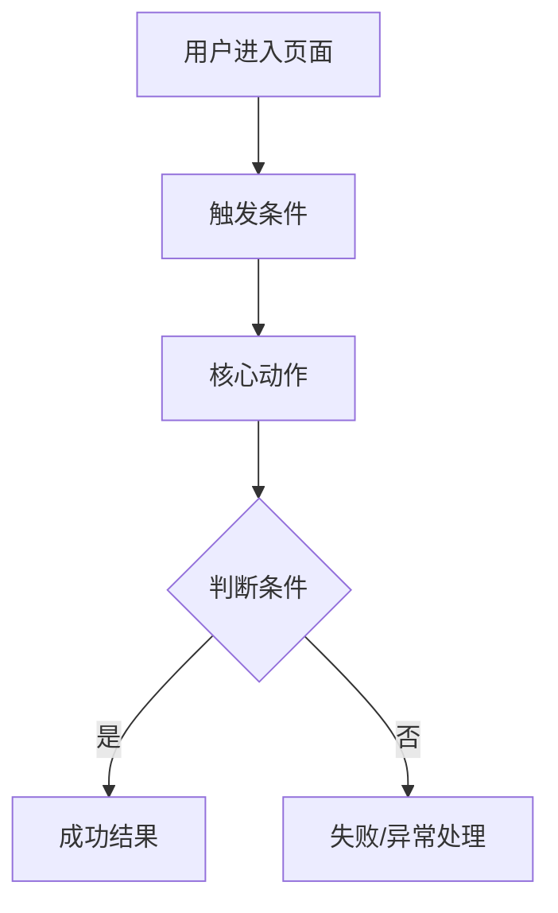

## 概述

本 Skill 负责**产品设计阶段**的全部工作。

输出物为可直接交付给 Codex 执行的 L3 Coding PRD（含 Plan Task 清单）。

**执行策略：** 先完成 L1 产品设计大纲 → L2 PRD → L3 全流程并展示确认，再进入后端。

**上游输入：** 任意形式的需求（一句话、草图、截图均可）

**下游交付：** L3 Coding PRD 已通过自检 + 用户确认 + 存入 GitHub `docs/prd/`

> 开发准备与执行阶段请使用 **prd-to-launch** Skill。

---

## HARD-GATE（硬性门槛）

> ⛔ 在完成完整的对话澄清流程并获得用户确认之前，**不允许输出任何 PRD 文档**。
> ⛔ 在 L3 Coding PRD 通过自检 + 用户确认 + 存入 GitHub 之前，**不允许宣告交接完成**。

---

## 调用决策树

```
收到任务
    │
    ├─ 有现成 L1/L2？
    │     → 询问：(A) 直接精化到 L3？(B) 先做 7 维度评估重新对齐？
    │
    ├─ 用户说「需求很简单，直接写」？
    │     → 「我先快速做 7 维度评估，5 分钟以内，确保一次写对。」
    │
    ├─ 用户说「帮我出 L3」？
    │     → 确认 L1/L2 是否存在，有则基于它们写；没有则从需求采集开始。
    │
    └─ 其他 → 从 Step 1 范围评估开始
```

---

# Step 1：范围评估

评估需求涉及的子系统数量。**判断标准：** 一个 PRD 对应的开发工作量不超过 2–4 周。超过则拆分，先确认最优先模块。

---

# Step 2：需求采集

### 接收任意形式输入

接受一句话、大白话、截图、草图，不要求固定模板。

### 7 维度评估（必须直接展示给用户）

| # | 维度 | 说明 | 优先级 |
| --- | --- | --- | --- |
| 1 | **背景与痛点** | 为什么要做？现状有什么问题？ | 必须 |
| 2 | **业务目标** | 做完后想达到什么效果？ | 必须 |
| 3 | **用户与场景** | 谁在什么具体情况下使用？ | 必须 |
| 4 | **核心用户旅程** | 用户从接触到完成目标的关键路径？ | 必须 |
| 5 | **现有方案** | 现在他们是怎么解决这个问题的？ | 重要 |
| 6 | **业务规则** | 有哪些必须遵守的约束或特定流程？ | 重要 |
| 7 | **参考与竞品** | 有没有对标产品或喜欢的设计参考？ | 加分 |

展示格式示例：

```
✅ 背景与痛点：清晰
✅ 业务目标：清晰
⚠️ 用户与场景：部分缺失
❌ 核心用户旅程：缺失
✅ 现有方案：清晰
⚠️ 业务规则：部分缺失
-  参考与竞品：未提及（可选）
```

### 至少 3 轮深度追问【每轮结束后等待用户回复】

- 每轮 3–5 个**开放式、启发式**问题（不用 A/B/C 选项）
- 每轮提问后**停止**，等待用户回复
- **第一轮**：聚焦「为什么」和「谁来用」
- **第二轮**：聚焦「怎么用」— 用户旅程关键节点、异常路径
- **第三轮**：聚焦「怎么算做好了」— 成功标准、一期/二期边界

> 在任何阶段，如果用户对设计决策提出疑问，立即进入**连环拷问模式**：识别疑问背后的未澄清维度 → 连续 2–4 个追问 → 澄清后同步更新当前文档层。

### 需求确认【等待用户确认】

所有必须维度（1–4）全部清晰且用户明确表示「没有补充了」后：

1. 结构化复述 7 维度最终理解
2. 确认一期/二期边界
3. 等用户确认「对的，开始写」

---

# Step 3：方案提议

提出 2–3 个可能的产品方案，每个包含：

- 核心思路（1–2 句）
- 主要优点 / 缺点或风险
- 推荐方案及理由

等用户选定后进入文档撰写。

---

# Step 4：L1 产品设计大纲

**目标读者：** 全体项目成员（含非技术）

**写作规则：** 纯自然语言，零代码零术语，每段 ≤150 字

**必须包含：**

- 📎 文档索引（L2/L3 快速入口）
- 背景与目标
- 用户角色与场景（「当…时，用户需要…，以便…」格式）
- 功能全貌
- 模块划分
- 一期/二期范围
- 关键约束与设计决策

**L1 文档模板：**

```markdown
# [功能名称] 产品设计大纲
**版本：** vX.X | **状态：** 待评审

## 📎 文档索引
| 文档 | 模块 | 状态 | 链接 |
|------|------|------|------|
| L2 前端 PRD | 前端 | 🔲 待产出 | — |
| L3 前端 Coding PRD | 前端 | 🔲 待产出 | — |

## 一、背景与目标
## 二、用户角色与场景
## 三、功能全貌
## 四、模块划分
## 五、一期 / 二期范围
## 六、关键约束与设计决策
```

**L1 完成后：** 生成一张 Mermaid 全局流程图（覆盖核心用户旅程与模块关系），用户确认后进入 L2。放在「用户角色与场景」板块。



**L1 自检：**

- [ ] 没有任何 TBD 或未填内容
- [ ] 没有技术术语
- [ ] 非技术背景的人读完能理解
- [ ] 一期/二期边界清晰

---

# 前端优先执行策略

> 🔄 L1 完成后，**先走完前端全流程**（L2 → 原型 → L3 → 用户确认），再进入后端。不允许前后端 L2/L3 同时推进。

```
L1 产品设计大纲 ✅
    │
    ├─ Round 1：前端
    │     Step 5：L2 前端 PRD
    │     Step 6：HTML 前端原型验证（可选）
    │     Step 7：L3 前端 Coding PRD
    │     → 🚦 Step 8：前端确认检查点（展示 + 用户确认）
    │
    ├─ Round 2：后端
    │     Step 5：L2 后端 PRD（复用同一模板）
    │     Step 7：L3 后端 Coding PRD（跳过原型）
    │     → 后端自检通过
    │
    └─ Step 9：交接 Codex
```

---

# Step 5：L2 传统 PRD

> 不要拆分为前端后端，需要是一个整体的 PRD

**写作规则：** 交互逻辑写「触发条件 → 动作 → 结果」三段式

**必须包含：**

1. 页面结构概览
2. 各区块详细说明（展示内容 + 交互规则 + 各状态）
3. 字段与数据来源
4. 状态与边界条件（空、加载、错误、权限不足）
5. 弹窗与流程说明
6. 视觉规范（语义描述）
7. 与后端的接口依赖（用途 + 业务层描述）

> ⚠️ API 信息统一从 GitHub 仓库获取：`docs/07_api`

**L2 自检：**

- [ ] 每个交互都有「触发条件、执行动作、结果状态」
- [ ] 没有「根据实际情况」「适当处理」等模糊描述
- [ ] 所有状态都有对应展示规则
- [ ] 字段全部有数据来源说明
- [ ] 与 L1 功能范围对应

---

# Step 6：HTML 原型验证（可选，强烈推荐）

**触发时机：** L2 完成确认后，进入 L3 之前。主动询问用户是否需要。

**原型规范：**

- 单文件 HTML，Tailwind CSS，现代简洁设计
- 包含关键交互状态：默认页、展开弹窗、成功/失败提示、空状态
- 支持 URL Hash 页面切换

> 🚨 **双向同步铁律：** 每次原型修改，必须**同时**更新 L2 PRD 对应章节，两者始终一致。

---

# Step 7：L3 Coding PRD

**目标读者：** Codex / AI 执行引擎 + 研发工程师

**写作原则：** 消除所有歧义 / 类型优先（TypeScript）/ 逻辑完整 / Phase 2 用 `// TODO [PHASE 2]` 占位

> ⚡ **分批输出策略（避免截断）：** L3 按以下 4 批依次输出，每批用户确认后再继续。
> - 批次 1：组件树 + State 定义
> - 批次 2：API Schema + 请求构造规则 + 测试用例
> - 批次 3：交互逻辑伪代码 + 视觉 Token + 边界条件 + 验收标准
> - 批次 4：Plan Task 清单（第 11 章）

**必须包含（11 章）：**

1. 组件树（完整层级，每个组件标注用途）
2. State 定义（TypeScript 类型 + 初始值 + 更新时机）
3. API Schema（Request/Response TypeScript 类型）
4. API 清单 + 请求构造规则 + 请求构造测试用例
   - 每个 API：method + path + 用途一句话
   - 每个 API：参数来源 → 拼接方式 → 完整示例
   - 每个 API：边界测试用例（只传 handle / 只传 pid / 特殊字符 encode / 关键参数缺失）
   - ❗ 真实参数从 `docs/07_api/test-case-field-checklist.md` 获取
5. 交互逻辑规范（伪代码，完整链条，不允许跳步）
6. 视觉 Token（十六进制值、px 值）
7. 边界条件与错误处理
8. 验收标准（AC-001 格式，每条可独立测试）
9. Phase 2 占位（`// TODO [PHASE 2]` 注释标注）
10. Mock 数据（基于 GitHub 真实数据，禁止随意编造）
11. **Plan Task — Codex 执行任务清单（强制）**

**Plan Task 格式：**

```
### Phase 1：基础组件搭建
- [ ] 实现 XXX 组件（对应 AC-001）
- [ ] 接入 XXX API（对应 AC-002, AC-003）

### Phase 2：交互与状态
- [ ] 实现 XXX 状态切换（对应 AC-005）
```

- 每条 Task 动词开头，粒度 10–20 min（Codex 单次执行粒度）
- 每条 Task 验收条件对应第 8 章具体 AC 编号

**L3 完成自检（同时作为阶段门控）：**

- [ ] 组件树完整，每个组件有清晰用途
- [ ] 所有 State 字段有类型和初始值
- [ ] 所有 API 有完整 Request/Response 类型定义
- [ ] 每个 API 有请求构造规则 + 测试用例
- [ ] 每个交互逻辑是完整链条，没有跳步
- [ ] 颜色是十六进制值
- [ ] 验收标准每条可独立测试
- [ ] Phase 2 全部用占位标注
- [ ] Mock 数据基于 GitHub 真实数据
- [ ] 没有「参考 L2」「根据设计」等模糊引用
- [ ] Plan Task 已完整列出，每条有范围/验收条件
- [ ] Task 顺序符合依赖关系，粒度适合 Codex 单次执行
- [ ] L1/L2/L3 三层一致性检查通过
- [ ] L3 已存入 GitHub `docs/prd/`

**三层一致性检查：**

- [ ] L1 所有功能点在 L2 都有对应章节
- [ ] L2 所有字段在 L3 都有类型定义
- [ ] L2 所有接口依赖在 L3 都有完整 Schema
- [ ] L1 一期范围和 L3 Phase 2 占位无矛盾
- [ ] 如有原型，原型里所有已确认的交互状态都在 L3 里有对应定义

---

# Step 8：🚦 前端确认检查点

> ✅ **前端 Round 完成后，必须在此停下展示并获得用户确认，才能进入后端 Round。**

### 展示内容

1. **L2 前端 PRD** 核心页面结构与交互逻辑摘要
2. **HTML 原型**（如有）— 让用户实际操作关键流程
3. **L3 前端 Coding PRD** 组件树概览 + Plan Task 清单
4. **前端三层一致性检查结果**

### 确认流程

```
展示上述内容给用户
    │
    ├─ 用户确认「前端没问题，继续后端」
    │     → 进入 Round 2：后端（从 Step 5 开始写 L2 后端 PRD）
    │
    ├─ 用户提出修改意见
    │     → 修改对应文档（L2/L3/原型）→ 重新展示 → 再次确认
    │
    └─ 用户说「需要大改」
          → 回到 Step 5 重新写前端 L2
```

### 后端 Round 说明

进入后端后，按同样的步骤执行：

- **Step 5**（L2 后端 PRD）→ **Step 7**（L3 后端 Coding PRD）
- 后端通常**跳过 Step 6 原型验证**（后端无 UI）
- 后端 L3 完成自检 + 三层一致性检查后，直接进入 Step 9 交接

---

# Step 9：交接 Codex

```
✅ L1 产品设计大纲 — 完成（vX.X）
✅ L2 [模块名] 传统 PRD — 完成（vX.X）
✅ L3 [模块名] Coding PRD — 完成（vX.X）
  └─ 含 Plan Task 清单（第 11 章）
[✅ HTML 原型 — 完成（如有）]

下一步（在 Claude Code / Codex 里执行）：
  使用 prd-to-launch Skill，粘贴以下指令：

「请执行 docs/prd/[模块名]-l3.md 中第 11 章 Plan Task 的任务清单。
 从 Phase 1 开始，逐个完成，每个 Task 完成后输出结果并等待确认后继续。
 参考 docs/arch/[模块名]-architecture.md 了解技术架构约束。
 测试执行必须使用 Codex Skills 文件夹下的 tdd Skill。」
```

---

# 红线清单

```
❌ 没完成 7 维度评估和至少 3 轮追问就开始写文档
❌ 用户没确认就推进到下一层
❌ 每轮提问后不等用户回复就继续输出
❌ 在 L1 里出现代码或技术术语
❌ 在 L3 里出现「适当处理」「根据实际情况」
❌ L3 交互逻辑有跳步
❌ Phase 2 功能在 L3 里被实现而不是占位
❌ 文档有未解决的 TBD 或空白章节
❌ 原型有更新但 L2 没同步
❌ L3 Plan Task 中有模糊泛泛的描述
❌ API Mock 数据随意编造，未从 GitHub ai-context-repo 获取
❌ 一次性输出整个 L3（必须分 4 批）
❌ 前端确认检查点未通过就开始写后端 L2/L3
```

---

# Notion 空间组织规范

```
📁 [模块名]
  ├── 📄 README（导航入口，必须始终最新）
  ├── 📄 L1 产品设计大纲
  ├── 📁 前端
  │     ├── 📄 L2 前端传统 PRD
  │     └── 📄 L3 前端 Coding PRD
  ├── 📁 后端
  │     ├── 📄 L2 后端传统 PRD
  │     └── 📄 L3 后端 Coding PRD
  └── 📄 L5 测试用例（开发阶段产出）
```

---

*idea-to-prd V1.0 · 从 Skill-Idea到上线 V4.0 拆分精简 · 2026-03-30*
