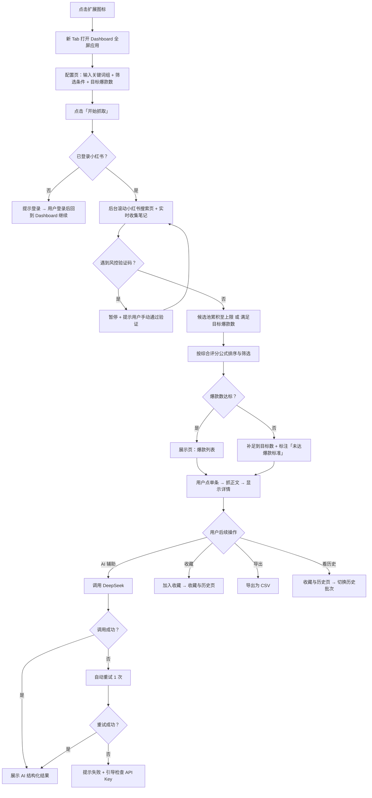

# xhs-radar 赛道爆款雷达 — 产品设计大纲

**版本：** v0.4 | **状态：** 待评审 | **日期：** 2026-05-08

> 项目代号：xhs-radar（中文名「赛道爆款雷达」，对应英文 Radar）

## 📎 文档索引

| 文档 | 模块 | 状态 | 链接 |
|------|------|------|------|
| L1 产品设计大纲（本文档） | 全局 | ✅ v0.4 | `docs/prd/xhs-radar-l1.md` |
| L2 传统 PRD | 全局 | ✅ v0.1 | `docs/prd/xhs-radar-l2.md` |
| L3 Coding PRD | 全局 | ✅ v1.0 | `docs/prd/xhs-radar-l3.md` |
| HTML 原型（可选） | 前端 | 🔲 待产出 | — |

---

## 一、背景与目标

小红书是各类垂直赛道做选题的重要内容池——AI 工具、母婴、护肤、副业、健身、家居等任何小众领域都适用。但是手动翻找效率低：每条笔记是否爆款不直观，需要把点赞、收藏、评论、博主粉丝数和发布时间凑在一起判断；看到好笔记没法系统沉淀；下次开新选题还要从头来一遍。

我们要做的工具，要解决三件事。第一，输入**任何赛道**的一组关键词，自动批量发现当下赛道里的爆款。第二，让用户在一个**像独立 Web 应用一样的全屏页面**里看完爆款列表与单条正文，并由 AI 辅助提取选题方向、写作结构和趋势关键词。第三，把今天发现的爆款收入"收藏库"，让今天的工作能服务明天的写作；每次抓取自动保存为历史批次，可随时回看或重新载入。

---

## 二、用户角色与场景

**目标用户：** 在小红书做内容创作的个人作者，**不限赛道**（一期仅服务作者本人）。

**核心场景（"当…时，用户需要…，以便…"）：**

- 当**准备写下一篇任意赛道笔记**时，用户需要**快速发现当下该赛道里互动量明显领先的爆款**，以便确定要写什么主题。
- 当**看到一条不错的爆款**时，用户需要**完整阅读它的正文 + 看到它的标题套路、内容结构和爆款原因分析**，以便理解为什么它能爆。
- 当**多个候选选题并行考虑**时，用户需要**把候选方向先收藏起来**，以便后续慢慢挑、不重复研究。
- 当**几天后再次开新选题**时，用户需要**回看上次抓的那批数据，或者重新跑一次新数据**，以便基于历史和当下做对比。

**核心流程图（含异常路径）：**

---

## 三、功能全貌

工具由三块组成。

**1. 抓取与判定。** 用户在配置页输入一组关键词、时间范围、爆款数量目标，插件自动在小红书搜索页采集候选笔记，按"互动评分 + 粉丝比 + 时间衰减"的综合公式筛出爆款。

**2. 全屏 Dashboard 浏览与 AI 辅助。** 点击扩展图标在浏览器新 Tab 中打开一个独立的 Dashboard 应用（视觉与体感等同 Web 应用），关闭 Tab 即退出。**三个页签**：
- **配置页**：关键词组、时间窗口、爆款阈值、目标数量、AI 密钥的设置入口
- **展示页**：爆款列表 + 筛选 / 排序 + 单条详情正文 + 4 个 AI 辅助 Tab
- **收藏与历史页**：已收藏的笔记列表 + 历史抓取批次切换器 + CSV 导出

**3. 沉淀与复用。** 看到好笔记一键加入收藏，每次抓取自动保存为历史批次，可随时切换查看；导出 CSV 供离线分析或备份。

---

## 四、模块划分

| 模块 | 职责 |
|------|------|
| **Dashboard 容器** | 浏览器新 Tab 打开的独立全屏应用页面（chrome-extension 协议） |
| **配置页** | 关键词组、时间窗口、爆款阈值、目标数量、AI 密钥的设置入口 |
| **展示页** | 爆款列表、筛选、排序、详情查看、4 个 AI 辅助 Tab |
| **收藏与历史页** | 已收藏笔记 + 历史批次切换 + CSV 导出 |
| **抓取模块** | 监听小红书搜索数据流、自动滚动、控制节奏、识别风控并安全暂停 |
| **判定模块** | 计算综合评分，应用用户设定的双阈值，做时间加权排序 |
| **AI 处理模块** | 调用 DeepSeek（用户自填密钥），完成四类结构化 AI 任务，含失败重试 |
| **数据模块** | 浏览器本地存储管理：抓取批次（最近 10 次）、收藏库、用户配置；不向任何服务器上传 |

---

## 五、一期 / 二期范围

### ✅ 一期 MVP（约 2.5 周）

- **形态**：点击扩展图标在浏览器新 Tab 打开全屏 Dashboard 应用
- **三个页签**：配置页 / 展示页 / 收藏与历史页
- 关键词组语义搜索 + 合并去重（**赛道通用，不限领域**）
- 时间窗口硬过滤（近 3 / 7 / 30 天 / 自定义）+ 时间衰减加权
- 候选池默认 200、上限 300
- 综合评分（互动加权）+ 点赞/粉丝比，双阈值用户可调
- 目标爆款 1–100 用户可设；不足兜底补足并标注「未达爆款标准」
- 仅对爆款抓正文（不抓全部候选）
- 4 个按需 AI 功能：选题建议 / 单条结构拆解 / 角度聚类 / 趋势词；含失败自动重试 1 次 + 失败提示
- 收藏库（一键收藏 + 收藏与历史页查看）
- 历史批次保存与切换（保留最近 10 次）
- CSV 导出
- 未登录提示、风控验证码暂停、满量自动停 + "继续找"入口

### ⏭️ 二期

- 笔记图片抓取与展示
- AI 改写 / 仿写新笔记
- 跨批次趋势对比
- 收藏笔记"已写"状态标记
- 多设备同步
- Edge / Firefox 兼容

---

## 六、关键约束与设计决策

| 约束 / 决策 | 说明 |
|---|---|
| **赛道通用** | 不针对特定领域，关键词组完全由用户输入决定 |
| **形态：全屏 Tab Dashboard** | 点扩展图标在新 Tab 打开独立 Dashboard 应用，体感等同 Web 应用；关 Tab 即退出 |
| **本质浏览器插件** | 抓数据靠插件能力（绕开反爬），UI 走独立 Tab 而非注入宿主页面 |
| **架构形态无关** | Dashboard 设计为独立 React 应用，未来切换浮层等其他形态成本低（约 0.5–1 天） |
| **仅作者自用** | 一期不做账号、权限、协作 |
| **完全本地运行** | 无服务器；所有数据存在用户自己浏览器里，不向任何第三方发送 |
| **数据来源唯一** | 只抓小红书网页版，要求用户已登录，不绕过风控机制 |
| **抓取节奏保守** | 候选池上限 300、滚动节奏随机化、详情仅对爆款抓取 |
| **AI 自带密钥（BYOK）** | 用户自填 DeepSeek API Key，仅存本地不外发 |
| **AI 失败可降级** | 单次失败自动重试 1 次，仍失败则提示并保留检查 Key 入口 |
| **AI 按需触发** | 不自动跑，由用户点 Tab 主动调用，省 token + 失败影响小 |
| **接口/页面变更预案** | 提供"诊断模式"快速定位失效环节 |
| **仅支持 Chrome** | 一期不考虑 Edge / Firefox |
| **一期不抓图片** | 选题主要看文字内容，图片留二期 |

---

## L1 自检

- [x] 没有任何 TBD 或未填内容
- [x] 没有技术术语（避开 manifest / chrome.storage / Shadow DOM 等实现细节）
- [x] 非技术背景的人读完能理解
- [x] 一期 / 二期边界清晰
- [x] 含 Mermaid 全局流程图（含异常路径）

---

*xhs-radar L1 v0.4 · idea-to-prd-v1 流程产出 · 2026-05-08*
